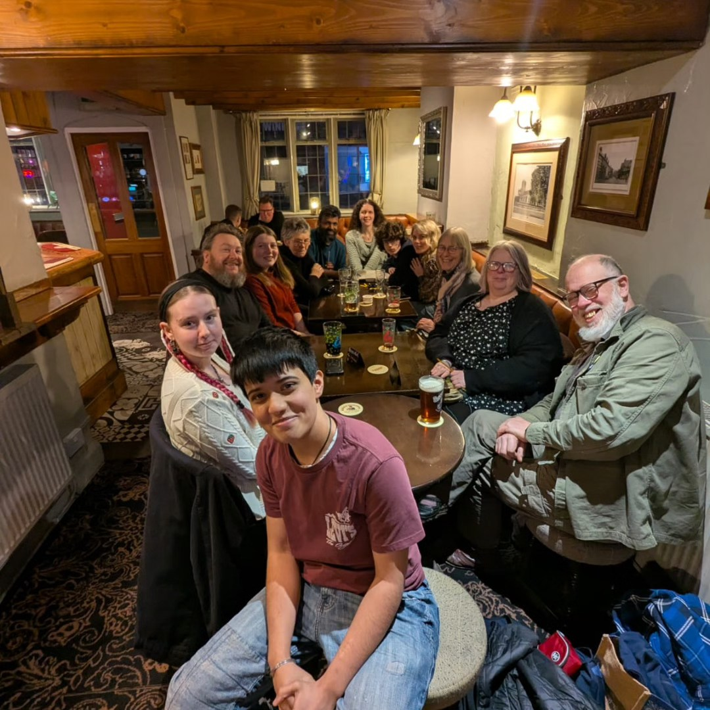

**Volunteer with Charnwood Eco Hub**

Are you passionate about sustainability, community, or simply looking for a
rewarding way to spend a few hours? We'd love to welcome you to the
Charnwood Eco Hub volunteer team.

[Charnwood Eco Hub Volunteer Form](https://forms.gle/s6V1XVuLssbp7LBu9){:.btn .btn--success}

{:width="75%"}

Our volunteers are at the heart of everything we do. Whether you're
helping to sort donations in our [Scrapstore](/projects/scrapstore),
supporting our [Library of Things](/projects/library-of-things), assisting
customers at our [refill station](/projects/refill-station), running
[workshops](/workshops-and-events), repairing items in our
[Makerspace](/projects/makerspace), helping at community events, or
lending a hand behind the scenes with admin, marketing or fundraising,
every contribution makes a real difference.

You don't need any previous experience – just enthusiasm, reliability and a
willingness to get involved. We'll provide guidance and support, and we'll
work with you to find a role that matches your interests, skills and
availability.

Volunteering with Charnwood Eco Hub is a great way to:

- Meet new people and become part of a friendly community.
- Learn new skills or share the ones you already have.
- Gain valuable experience for work or education.
- Improve your confidence and wellbeing.
- Help reduce waste and support a more sustainable Charnwood.
- Make a positive impact in your local community.

Whether you can spare a couple of hours each month or a regular day each
week, your time will help us grow our services and inspire more people to
live sustainably.

We welcome volunteers of all ages (subject to role requirements) and from
all backgrounds. Whatever your experience, there's a place for you at
Charnwood Eco Hub.

If you're interested in volunteering, we'd love to hear from you. [Get in
touch](mailto:charnwoodecohub@gmail.com), or pop into the Hub for a chat
about how you can get involved.

